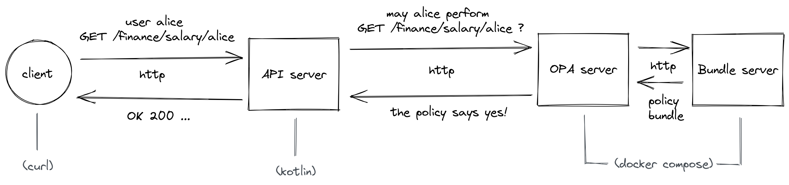

<div style="text-align: center;">

# Open Policy Agent HTTP API example

<a href="https://www.openpolicyagent.org/"></a>
<a href="https://kotlinlang.org/"></a>

A minimalistic example of restricting an HTTP API with OPA

</div>


## Get started

1. Start the API server (kotlin application)
   ```
   ./gradlew run
   ```
2. Start the OPA server (+ bundle server)
    ```
    docker compose -f opa/docker-compose.yml up
    ```  


### Being the client - sample requests to the API server

```
allowed:
curl --user alice:password localhost:5000/finance/salary/alice

forbidden:
curl --user alice:password localhost:5000/finance/salary/charlie
```

# What happens here?



On each HTTP request from a client to the API server, 
the API server asks the OPA server whether the requesting client
is authorized to perform this action.
Depending on the answer of OPA, 
the clients request will be processed or rejected.  


## Policy / Bundle

Why does the OPA server knows about the permissions of a client?
From the policy!

- The policy is defined in the `example-policy.rego` file
- From this file a bundle was built using the OPA executable
- This bundle is persisted in and shipped from the bundle server to the OPA server


## How to edit and apply the policy?

1. Make changes to the policy file
2. [Download and install](https://www.openpolicyagent.org/docs/v0.11.0/get-started/) the Open Policy Agent. *Tip: drop the opa executable to ~/.local/bin, so it is on the PATH.*
3. Build the policy and move the resulting bundle to the correct folder so that it can be collected by the bundle server
    ```sh
    cd opa
    opa build example-policy.rego
    mv bundle.tar.gz bundles
    ```


# References

- Inspired by https://www.openpolicyagent.org/docs/latest/http-api-authorization/
- Corresponding python implementaion https://github.com/open-policy-agent/contrib/tree/main/api_authz
